<p align="center">
  
</p>

<h1 align="center">ECA-PP: Standardized Single-Cell Preprocessing</h1>

<p align="center">
  <strong>Give real-world single-cell data a consistent starting point.</strong>
</p>

<p align="center">
  <a href="https://pypi.org/project/eca-pp/"></a>
  <a href="pyproject.toml"></a>
  <a href="#where-it-fits"></a>
  <a href="https://github.com/chansigit/eca-rsi"></a>
</p>

<p align="center">
  <a href="#why-standardize-before-analysis">Why ECA-PP?</a>
  &nbsp;&nbsp;&nbsp;
  <a href="#what-you-get">What you get</a>
  &nbsp;&nbsp;&nbsp;
  <a href="#try-it">Try it</a>
  &nbsp;&nbsp;&nbsp;
  <a href="#faq">FAQ</a>
  &nbsp;&nbsp;&nbsp;
  <a href="#further-reading">Further reading</a>
</p>

<br>

ECA-PP prepares published single-cell RNA sequencing datasets for reuse. Starting
from an **H5AD file**, it finds expression counts, standardizes gene names,
calculates quality-control measurements, and identifies useful batch and
cell-type metadata. You get prepared data and a record of the evidence behind
each decision.

ECA-PP belongs to the **Ensemble Cell Atlas (ECA)** ecosystem. It handles routine
preprocessing for **[ECA-RSI](https://github.com/chansigit/eca-rsi)**
(Recursive Self-Improvement), ECA's automated data governance system, so that
system can focus on quality assessment, annotation, and iterative refinement.
You can also use ECA-PP independently in your own pipeline.

<br>

<a id="why-standardize-before-analysis"></a>

## 🔬 Why standardize before analysis?

Public single-cell data reflects the choices of many different authors.
Expression matrices arrive as text tables, sparse matrix files, Seurat objects,
or H5AD files, often with metadata in separate supplements. Converting them into
one format solves only part of the problem.

Inside an H5AD file, expression values may be raw, normalized, or scaled. Gene
names may mix old symbols and Ensembl IDs. Sample and cell-type columns may use
unfamiliar names, duplicate one another, or contain missing values. Even existing
QC measurements may have been calculated using different gene sets.

ECA-PP gives these recurring problems a shared treatment:

- **Consistent preprocessing across studies.** Counts checks, gene mapping, and
  QC use a common implementation. QC and normalized expression are calculated
  on the same final gene set.

- **Metadata choices supported by data.** Small integration trials test batch
  candidates for improved mixing and preservation of cell-type structure.
  Technical and donor factors take priority over biological conditions.

- **Automation you can inspect.** Model suggestions pass programmatic checks;
  built-in rules keep column identification moving when a model is unavailable.
  Decisions, changes, and unresolved questions are recorded for review.

<br>

<a id="what-you-get"></a>

## 📦 What you get

- **A standardized dataset.** An H5AD with counts, normalized expression,
  standardized gene names, QC measurements, and preserved author metadata.

- **Guidance for downstream analysis.** Proposed batch and existing cell-type
  columns, evidence for each selection, and an assessment of whether batch
  correction is needed.

- **A record of what happened.** Each step writes a `result.json` describing its
  outcome, changes, and issues that need attention. Your source file stays unchanged.

<br>

## Where it fits

General-purpose agents can usually download files, unpack archives, and script
conversions into `.h5ad`, the AnnData format used by Scanpy. **ECA-PP starts at
H5AD**, where decisions about counts, gene identity, QC, and batch structure need
domain-specific standards applied consistently across studies.

| Stage | Responsibility |
| --- | --- |
| Upstream tools or agents | Gather published files and convert them into H5AD. |
| ECA-PP | Standardize the data and evaluate metadata using shared rules and recorded evidence. |
| ECA-RSI | Coordinate subsequent quality review, annotation, and iterative refinement. |

ECA-PP currently prepares data and evaluates metadata. It does not assign new
biological cell-type labels, filter individual low-quality cells or doublets,
or produce a final integrated atlas.

Follow the main path below; the lower branches show required review, dataset
rejection, and the trial loop used to evaluate metadata. Click the diagram for
an interactive version with search, zoom, and guided views.

<p align="center">
  <a href="https://raw.githack.com/chansigit/eca-pp/main/docs/workflow.html">
    <picture>
      <source media="(prefers-color-scheme: dark)" srcset="assets/eca-pp-workflow-dark.svg">
      
    </picture>
  </a>
</p>

<br>

<a id="try-it"></a>

## 🚀 Try it

### 1. Install

Use Python 3.10 or newer, preferably in a dedicated environment. ECA-PP runs on CPUs.

```bash
pip install "eca-pp[probe,openai]==0.5.1"
```

This also installs `stancounts` and `stangene`, the counts-recovery and gene-mapping
dependencies. To work on ECA-PP itself, clone this repository and use
`pip install ".[probe,openai]"` instead.

### 2. Standardize your dataset

Replace `your-data.h5ad` with your input file:

```bash
eca-pp-standardize your-data.h5ad -o results/standardize
```

Open **`results/standardize/result.json`** to check the outcome. A successful run
produces `standardized.h5ad`. If a required choice is unresolved, such as the
species, the report explains what needs clarification before you continue.

<details>
<summary>Dataset size checks and gene filtering</summary>

The default checks require at least **100 cells and 5,000 detected genes across
the whole dataset**. A gene is detected if it has a nonzero count in at least one
cell. **This is not a requirement for each cell to express 5,000 genes.**

By default, features that cannot be mapped to a canonical gene are removed from
the output. Use `--keep-unmapped` to retain them. The dataset-level gene threshold
is checked again after gene mapping and filtering.

See the [tutorial's options](https://github.com/chansigit/eca-pp/blob/main/docs/tutorial.md#4-常用参数) for adjusting size checks
or specifying the species and counts layer.

</details>

### 3. Identify batch and cell-type columns

After successful standardization, run:

```bash
eca-pp-identify-columns results/standardize/standardized.h5ad \
  -o results/columns
```

For AI-assisted decisions, set `ARK_API_KEY` in your environment before running
this command. The default uses Doubao Turbo through the OpenAI Agents SDK.
Without model credentials, ECA-PP uses built-in rules and integration trials.

Read **`results/columns/result.json`** for the selected columns and supporting
evidence. For example, ECA-PP may identify a sequencing channel as the batch but
conclude that the cells are already sufficiently mixed and correction is unnecessary.

<details>
<summary>Find the output files</summary>

| File | Contents |
| --- | --- |
| `results/standardize/standardized.h5ad` | Prepared expression data, gene identifiers, and QC measurements. |
| `results/standardize/result.json` | Input checks, counts source, species, gene changes, and review notes. |
| `results/columns/result.json` | Selected metadata, correction assessment, decisions, and trial results. |
| `results/columns/batch.tsv` | Batch labels when the selected grouping is derived from barcodes or multiple columns; created only when needed. |

</details>

<br>

## FAQ

### Does ECA-PP change my original data?

The source file stays unchanged. ECA-PP writes a separate dataset, preserves
author metadata, and backs up fields it replaces. Gene mapping and filtering
changes are recorded. Standardization may reject a whole dataset that fails its
checks, but does not remove individual cells from an accepted dataset.

### What does an empty batch or cell-type result mean?

`null` means no suitable column was selected. This can be a valid outcome when
evidence is insufficient. A selected batch with `correction: "unnecessary"`
means the evidence did not support correcting it. Neither conclusion should be
confused with an execution error; check the outcome and reasons in `result.json`.

### Do I need an AI model?

Standardization runs locally by default; optional AI assistance is available for
unresolved species inference. Column identification uses a model when configured
and falls back to built-in rules when it is unavailable. See the
[model configuration guide](https://github.com/chansigit/eca-pp/blob/main/docs/tutorial.md#8-识别批次列--细胞类型列identify-columns)
for backend and model choices.

### Can I recover counts from normalized data?

ECA-PP uses [stancounts](https://github.com/chansigit/stancounts) to recover counts
from supported transformed inputs when possible. Recovery depends on the data;
unsupported or ambiguous cases are reported rather than silently treated as raw counts.

<br>

<a id="further-reading"></a>

## 📖 Further reading

**For users:** the [hands-on tutorial](https://github.com/chansigit/eca-pp/blob/main/docs/tutorial.md) walks through a real
mouse dataset, result interpretation, common options, model setup, and reruns.
The tutorial is currently in Chinese. Each command also provides `--help`.

**For developers:** the [standardization specification](https://github.com/chansigit/eca-pp/blob/main/docs/standardize-spec.md)
and [column-identification specification](https://github.com/chansigit/eca-pp/blob/main/docs/identify-columns-spec.md) describe
methods, interfaces, and tests. Download the
[interactive architecture diagram](https://github.com/chansigit/eca-pp/blob/main/docs/architecture.html) to open it in a browser.

**Continue in the ECA ecosystem:** [ECA-RSI](https://github.com/chansigit/eca-rsi)
coordinates downstream analysis, including sample-level QC and annotation with
[OSP](https://github.com/chansigit/osp).

For questions, unexpected results, or feature requests,
[open an issue](https://github.com/chansigit/eca-pp/issues).
